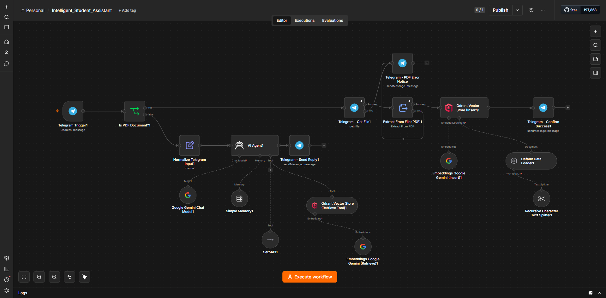
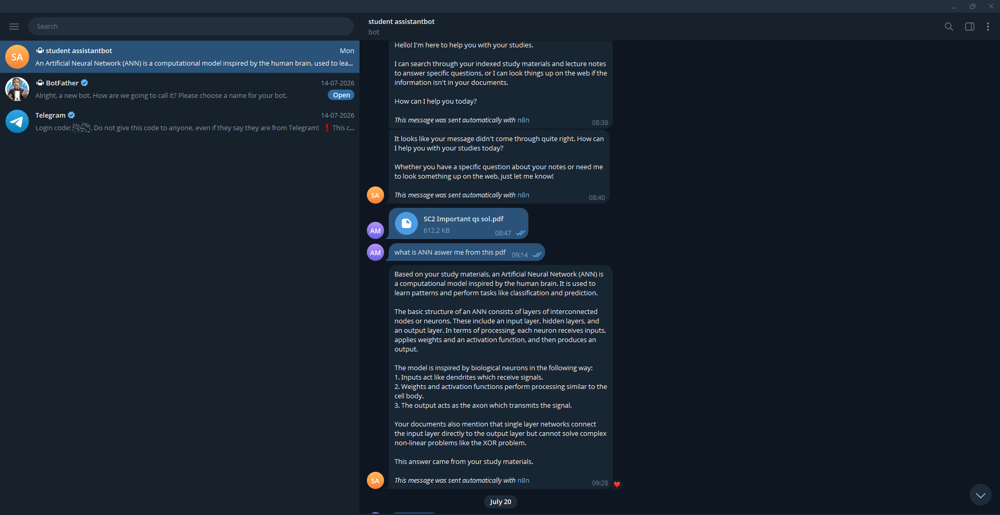
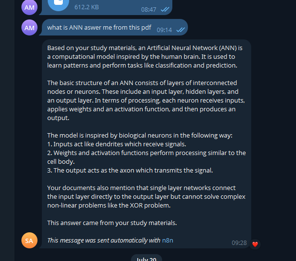

# 📚 AI Student Assistant using RAG

An AI-powered Telegram Student Assistant that answers questions from uploaded study materials using **Retrieval-Augmented Generation (RAG)**. The system is built with **n8n**, **Google Gemini**, **Qdrant Vector Database**, and the **Telegram Bot API**.

---

## 👨‍🎓 Project Title

**AI Student Assistant using Retrieval-Augmented Generation (RAG)**

---

## 🎯 Problem Statement (Objective)

Students often have to search through lengthy PDF notes and study materials to find answers to their questions. This process is time-consuming and inefficient.

The objective of this project is to develop an AI-powered Telegram chatbot that allows students to upload PDF study materials and ask questions in natural language. The chatbot retrieves the most relevant information from the uploaded documents and generates accurate answers using Google Gemini.

---

## 💡 Solution Overview

The project uses a Retrieval-Augmented Generation (RAG) pipeline.

1. Users upload PDF study materials through Telegram.
2. The PDF is extracted and divided into smaller text chunks.
3. Google Gemini Embeddings converts each chunk into vector embeddings.
4. The embeddings are stored in a Qdrant Vector Database.
5. When a student asks a question, the AI retrieves the most relevant document chunks.
6. Google Gemini generates a final response based on the retrieved context.
7. The answer is sent back to the student through Telegram.

---

# 🏗️ System Architecture

```
Student
    │
    ▼
Telegram Bot
    │
    ▼
n8n Workflow
    │
    ├──────────────► PDF Upload
    │                     │
    │                     ▼
    │              Extract PDF Text
    │                     │
    │                     ▼
    │              Split into Chunks
    │                     │
    │                     ▼
    │          Gemini Embeddings
    │                     │
    │                     ▼
    │              Qdrant Vector DB
    │
    ▼
User Question
    │
    ▼
Retrieve Similar Chunks
    │
    ▼
Google Gemini LLM
    │
    ▼
Telegram Response
```

---

# 🖼️ Workflow Screenshot



---

# 📂 Data Structure

```
PDF Document
      │
      ▼
Extracted Text
      │
      ▼
Text Chunks
      │
      ▼
Gemini Embeddings
      │
      ▼
Qdrant Vector Store
      │
      ▼
Semantic Search
      │
      ▼
Google Gemini
      │
      ▼
Telegram Reply
```

---

# 🛠️ Technologies Used

- n8n
- Google Gemini API
- Google Gemini Embeddings
- Qdrant Vector Database
- Telegram Bot API
- Docker
- ngrok
- Retrieval-Augmented Generation (RAG)

---

# 🧩 n8n Nodes Used

- Telegram Trigger
- IF Node (PDF Detection)
- Telegram Get File
- Extract From File (PDF)
- Recursive Character Text Splitter
- Default Data Loader
- Google Gemini Embeddings
- Qdrant Vector Store (Insert)
- Normalize Telegram Input
- AI Agent
- Google Gemini Chat Model
- Qdrant Vector Store (Retrieve)
- Simple Memory
- Telegram Send Message

---

# ⚙️ Workflow Explanation

### PDF Upload Process

1. User uploads a PDF through Telegram.
2. The workflow detects whether the uploaded file is a PDF.
3. The PDF is downloaded.
4. Text is extracted from the PDF.
5. The extracted text is divided into smaller chunks.
6. Gemini Embeddings converts each chunk into vectors.
7. The vectors are stored in the Qdrant Vector Database.
8. A confirmation message is sent to the user.

---

### Question Answering Process

1. Student sends a question.
2. The message is normalized.
3. AI Agent receives the question.
4. Relevant document chunks are retrieved from Qdrant.
5. Gemini generates an answer using the retrieved context.
6. The answer is returned through Telegram.

---

# 📸 Output Examples

### Uploading a PDF



---

### Asking Questions

**Question**

```
What is Artificial Neural Network?
```

**Answer**

```
Artificial Neural Network (ANN) is a computational model inspired by
the biological neural network of the human brain...
```



---

# 🚀 Implementation Steps

1. Install Docker Desktop.
2. Run n8n using Docker.
3. Run Qdrant using Docker.
4. Configure Telegram Bot API.
5. Configure Google Gemini API.
6. Configure Google Gemini Embeddings.
7. Configure ngrok for public webhooks.
8. Build the n8n workflow.
9. Activate the workflow.
10. Upload PDF study materials.
11. Start asking questions through Telegram.

---

# 📁 Repository Structure

```
AI-Student-Assistant-RAG
│
├── README.md
├── Intelligent_Student_Assistant.json
│
└── assets
    ├── workflow.json
    ├── workflow.png
    ├── pdf-upload.png
    ├── answer-example.png
    └── welcome.png
```

---

# ✨ Features

- Upload PDF study materials
- AI-powered question answering
- Retrieval-Augmented Generation (RAG)
- Semantic search
- Telegram chatbot interface
- Conversation memory
- Google Gemini integration
- Vector database search using Qdrant

---

# 🔮 Possible Improvements

- Support multiple PDFs per user
- User authentication
- OCR support for scanned PDFs
- Voice message support
- Web search integration (SerpAPI)
- Cloud deployment
- Multi-language support
- Admin dashboard
- Conversation history database

---

# 📈 Future Scope

The project can be extended into a complete educational assistant capable of handling multiple subjects, supporting voice interactions, summarizing documents, generating quizzes, and integrating Learning Management Systems (LMS).

---

# 👨‍💻 Author

**Aryya Manna**

B.Tech in Computer Science & Engineering (AI & ML)

Brainware University

---

# 📜 License

This project was developed for academic and educational purposes under the IDEAS Internship Program.
